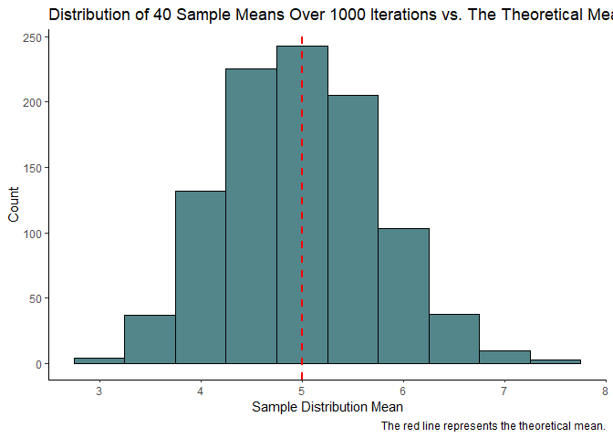
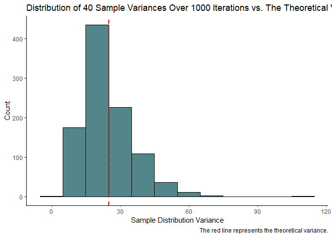

## Part 1

-----

### # Overview

-----

The first part of the project will explore an exponential distribution. We'll look into two statistics, the mean and variance, and explore a bootstrapped sample of these statistics and compare it to the respective population mean and variance.

### # Simulations

-----

First, I'll import the required packages for this project.


```r
# load packages
library(ggplot2)
library(dplyr)
```

Next I'll run the simulated exponential distributions.


```r
# define distribution constants
lambda <-  0.2
n <-  40

# exponential distributions
bs_mean <- NULL
bs_variance <- NULL

for (i in 1:1000)
  bs_mean <- c(bs_mean, mean(rexp(n, lambda)))

for (i in 1:1000)
  bs_variance <- c(bs_variance, var(rexp(n, lambda)))
```

### # Sample Mean Versus Theoretical Mean

-----


```r
# plot sample means and compare to theoretical mean of the distribution
ggplot(data.frame(bs_mean), aes(x = bs_mean)) + 
  geom_histogram(color = 'black', fill = 'cadetblue4', binwidth = 0.5) + 
  xlab('Sample Distribution Mean') + 
  ylab('Count') + 
  labs(caption = 'The red line represents the theoretical mean.') + 
  ggtitle('Distribution of 40 Sample Means Over 1000 Iterations vs. The Theoretical Mean of an Exponential Distribution') + 
  geom_vline(xintercept = (1 / lambda), color = 'red', linetype = 'dashed', size = 1) + 
  theme_bw() + 
  theme(panel.border = element_blank(), panel.grid.major = element_blank(), panel.grid.minor = element_blank(), axis.line = element_line(colour = "black"))
```

<!-- -->

```r
# comparing means numerically
bs_mean_diff <- mean(bs_mean) - (1 / lambda)
paste('The difference between the bootstrapped mean (mean(bs_mean)) and the theoretical mean (1 / lambda) is ', round(bs_mean_diff, 4), '.', sep = '')
```

```
## [1] "The difference between the bootstrapped mean (mean(bs_mean)) and the theoretical mean (1 / lambda) is -0.0156."
```

As seen in the graph above, the theoretical mean is closely aligned with the bootstrapped mean. The actual difference can be seen in the console output above. Given the central limit theorem we expect to see, and we actually do see, that taking random samples of a specific statistic (e.g., mean, variance, etc.) and plotting these shows a somewhat normal distribution. Additionally, the mean of these samples provide insight into the comparative population parameter (e.g., mean, variance, etc.).

### # Sample Variance Versus Theoretical Variance

-----


```r
# plot sample variance and compare to theoretical variance of the distribution
ggplot(data.frame(bs_variance), aes(x = bs_variance)) + 
  geom_histogram(color = 'black', fill = 'cadetblue4', binwidth = 10) + 
  xlab('Sample Distribution Variance') + 
  ylab('Count') + 
  labs(caption = 'The red line represents the theoretical variance.') + 
  ggtitle('Distribution of 40 Sample Variances Over 1000 Iterations vs. The Theoretical Variance of an Exponential Distribution') + 
  geom_vline(xintercept = ((1 / lambda)^2), color = 'red', linetype = 'dashed', size = 1) + 
  theme_bw() + 
  theme(panel.border = element_blank(), panel.grid.major = element_blank(), panel.grid.minor = element_blank(), axis.line = element_line(colour = "black"))
```

<!-- -->

```r
# comparing means numerically
bs_mean_diff <- mean(bs_mean) - (1 / lambda)
paste('The difference between the bootstrapped variance (mean(bs_variance)) and the theoretical variance ((1 / lambda)^2) is ', round(bs_mean_diff, 4), '.', sep = '')
```

```
## [1] "The difference between the bootstrapped variance (mean(bs_variance)) and the theoretical variance ((1 / lambda)^2) is -0.0156."
```

As seen in the graph above, the theoretical variance is closely aligned with the bootstrapped variance. The actual difference can be seen in the console output above. Given the central limit theorem we expect to see, and we actually do see, that taking random samples of a specific statistic (e.g., mean, variance, etc.) and plotting these shows a somewhat normal distribution. Additionally, the mean of these samples provide insight into the comparative population parameter (e.g., mean, variance, etc.).

### # Distrbution

-----

The plots above show the distribution histograms of the measured statistic: mean for the first plot and variance for the second. Though we only pulled 1000 iterations of the 40 samples, we can see that the distribution of these are following a somewhat normal distribution. This follows what we know given the central limit theorem.

<div id="dot">. . .</div>
